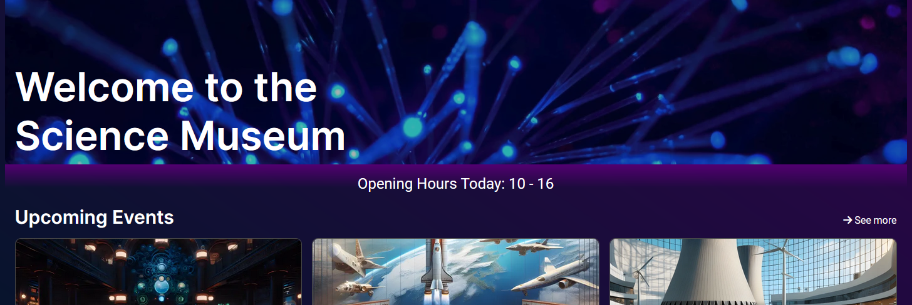

# Semester-Project-1

This was the semester project for the first semester of Frontend Development, at Noroff School of Technology and Digital Media.
The project is deployed on netlify [here](https://main--splendorous-unicorn-f120c1.netlify.app)

## Table of contents:
- [About](#about)
    - [Features](#features)
    - [Technical Specification](#technical-specification)
    - [Tools used](#tools-used)
    - [Deployment](#deployment)
- [Requirements](#requirements)
- [Installing](#installing)
    - [Running](#running)
- [Process](#process)
  - [Design-Process](#design-process)
  - [Production-Process](#production-process)
- [Reflection](#reflection)
- [Contact](#contact)

## About

This was the semester project for the first semester of Frontend Development, at Noroff School of Technology and Digital Media.
The project revolves around the creation of a website for a new interactive science museum tailored to the primary and middle school demographic, and families with young children.

### Features

The project features a responsive website with 17 pages, catering to screen sizes ranging from 300 pixels to a capped width of 1440 pixels. Key features include:

- Hamburger Menu:
  - A responsive hamburger menu is implemented for devices with a width of 900 pixels and smaller.
- Dynamic Opening Hours:
  - Using JavaScript, the front page dynamically displays accurate opening hours based on the current day of the week.
- Interactive Map:
  - The "Visit us" page features an interactive map created using Leaflet.js and OSM-Generator.
- Content Descriptions:
  - ChatGPT 3.5 is employed for generating creative and engaging content descriptions throughout the website.
- Form Handling:
  - Netlify's form detection is utilized for form handling, although backend support for booking or newsletters is not implemented.

The pages featured in this project are as follows:
- Front page
- Visit us
- School info page
- Exhibitions page
  - 6 exhibition detail pages
- Events page
  - 6 event detail pages

### Technical Specification

#### Tech:
- HTML:
  - The project utilizes semantic HTML to ensure proper document structure and accessibility.
- CSS:
  - External CSS stylesheets are employed, following the DRY (Don't Repeat Yourself) principle. The styles are well-organized and contribute to a visually appealing design.
- JavaScript:
  - JavaScript is used to enhance user interactivity, such as displaying dynamic opening hours on the front page and implementing a responsive hamburger menu.
- [Leaflet.js](https://leafletjs.com) / [OSM-Generator](https://www.osm-generator.com) :
  - The project incorporates Leaflet.js and OSM-Generator to create an interactive map on the "Visit us" page.

#### Tools used:
- Figma:
  - Figma was employed for the design process, starting from mid-fidelity sketches to high-fidelity designs. It facilitated a mobile-first design approach, with iterations to achieve a high-fidelity design.
- Webstorm:
  - Webstorm served as the primary integrated development environment for coding.
- Sourcetree/Git:
  - Git version control was managed using Sourcetree, with branches created for different features or issues. Commits were made locally and pushed to the GitHub repository, followed by merging through GitHub.
- GitHub/GitHub Project Board/Roadmap:
  - GitHub Project Boards and Roadmap were utilized for project management, including issue tracking, pull requests, and overall progress monitoring.
- Bing Image Generator:
  - Images for the project, were created using the Bing image generator.
- ChatGPT 3.5:
  - ChatGPT 3.5 was utilized for generating content descriptions within the project.
- FontAwesome:
  - FontAwesome was used to incorporate vector icons into the project.

### Deployment:

The site is deployed through Netlify [here](https://main--splendorous-unicorn-f120c1.netlify.app)

## Requirements

The requirements for the semester project was as follows:

- The site must have a design that appeals to the target audience.
- The site must have at least 4-6 pages.
- Compositional principles, typography, and color schemes must be considered.
- Your HTML should be semantic and neatly indented.
- The site should use external CSS style sheets which follow the DRY principle.
- The site should download quickly, and not be overly "heavy". Images should not be over 200kb.
- The site should take WCAG principles into consideration, especially regarding hierarchy, navigation, and color usage.
- The site should be responsive, attractive, and easy to use on a variety of devices.
- The site should show consideration for content strategy and SEO (consider your use of meta tags and alt text).
- The GitHub repo for the project should be set to public.

## Installing
Clone the project repository to your local machine.
```bash
git clone https://github.com/Eikhaugen/Semester-Project-1.git
```
### Running

Use webstorm, VSCode or any other code editor to run the project using liveserver.


## Process

The process of making this began with the Project Methodology Course Assignment, where the goal was to use a planning tool like GitHub Project Boards, Trello, Jira, or other...
To plan a schedule for the Semester Project.
<br>
I decided to use GitHub Project boards and roadmap because GitHub is a tool I already use, and I thought it would be great to manage pull requests, issues and branches all in one place. <br>
I initially planned to spend one week designing, two weeks for coding and one week for documentation, adding additional features or fixes.

### Design-Process
I began by rough sketching some low-fidelity designs on paper, then moved on to Figma to create mid-fidelity designs, designing mobile first and then desktop.
The mobile design in Figma is designed at 360px wide, desktop is 1440px wide.
The high-fidelity design saw many changes and iterations even through the coding process.

### Production-Process
I used GitHub to create branches from issues, using sourcetree I checkout the branches locally on my mac. Then I do some work before committing, pushing and then merging on GitHub, closing the issue automatically before opening a new branch through GitHub.

Using webstorm, I first created all the main html and css-files that I had set out to create, as well as the basic folder structure I would be working with.

I first created the header, mobile first, then with media queries I made the desktop version.
I made a hamburger menu for phones/ tablets using javascript.

Then I made the footer, the design was very simple when I first set out to code. The footer saw major changes throughout the coding process.
I would later add a newsletter signup and social media icons to the footer, and then later add a background image to both the header and footer.

After making the initial header and footer, I began making the five pages I first set out to create.
Starting with the front page and then making the other pages one by one.
When the main pages were finished, I decided to add event and exhibition detail pages.
I decided on using ChatGPT 3.5 for all descriptions in the pages, instead of using Lorem Ipsum or other placeholder text, as I find it can be quite monotonous and lifeless.

Assets were made using Bing image creator, I used Figma to resize the images, exported them as jpg and converted them to webp.
Made sure that all images were under the 200KB limit set by the task requirements.

I deployed the project on Netlify, checked it out on my phone and multiple browsers.
Did changes and bugfixes as needed.

## Reflection

I feel like the task wasn't all that inspiring, and I already struggle with designing.
Still I am quite satisfied with the design on mobile, less so on desktop.
The design I coded, began deviating quite a bit from the design I had made on Figma, as I felt the initial design didn't work well.
The final design in Figma, and the final coded design are quite dissimilar. This is an area I will have to improve on, making better designs and sticking to them once I start coding.


I am quite content with my code and the pace I maintain while coding.
Overall I think the semester project went well.


## Contact

Find me here:

[My LinkedIn page](https://www.linkedin.com/in/thomas-eikhaugen-897234264/)  
[My GitHub page](https://github.com/Eikhaugen)
